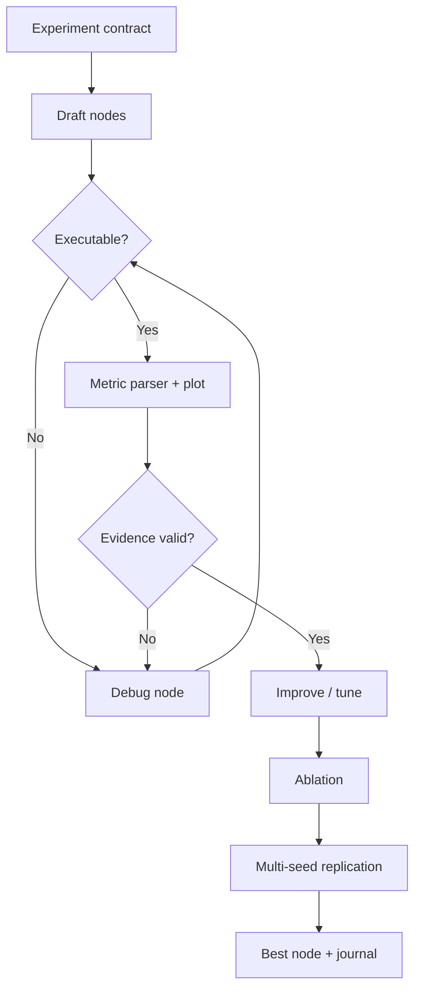
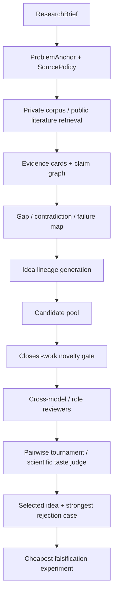
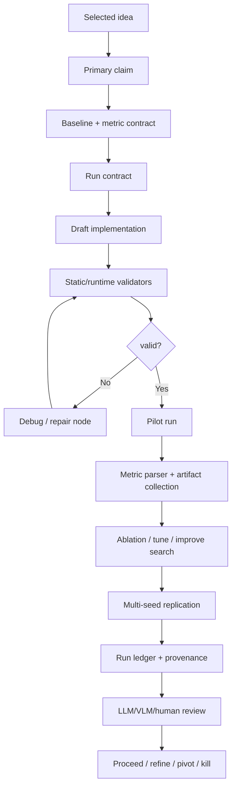

# 科研 Agent 机制深度调研：从前沿 idea 到可执行实验

更新日期：2026-04-25

本文目标不是给项目排名，而是抽取机制：哪些设计能让 agent 提出更接近前沿、理论更完整、可被实验验证的 idea；哪些设计能把 idea 落成细致、可执行、可审计的实验方案；这些机制背后的底层原理是什么，为什么更简单的 prompt chain 无法达到同等效果。

本版修正了一个关键问题：调研范围不再按抽样项目判断充分，而是以 [Awesome-Autonomous-Research-Agent](https://github.com/LTzycLT/Awesome-Autonomous-Research-Agent) 清单作为覆盖基准，并补充通用热门 agent 系统。对清单中带 arXiv 论文的项目，已先下载 arXiv e-print；能取得 TeX source 的项目使用 `arxiv-to-prompt` 转成扁平 TeX，`data-to-paper` 的 e-print 只返回 PDF，因此使用 PDF text fallback，并在证据表中明示。

重点聚焦两条主线：

1. 如何提出优质、前沿、理论完善、能经受 reviewer 压力的 idea。
2. 如何设计完善、细致、切实可行、可复现的实验方案。

---

## 调研范围与证据口径

源码快照主要在：

```text
/tmp/resmax_agent_deep_research_sources/
```

本地 ARIS / Auto-claude-code-research-in-sleep skill 源码在：

```text
/Users/zhangzhao/Code/Auto-claude-code-research-in-sleep/skills/
```

arXiv 转换产物在：

```text
/tmp/resmax_agent_deep_research_sources/arxiv_sources/
```

证据分级：

| 等级 | 含义 |
|---|---|
| A | 已读源码、skill 或论文原文，能定位机制实现 |
| B | 已读项目文档，并用源码抽样复核 |
| C | 只作为背景参考，不作为核心结论依据 |

### Awesome 清单覆盖表

| 项目 | 证据 | 论文处理 | 本文使用方式 |
|---|---:|---|---|
| autoresearch | A | 未标论文 | 代码搜索最小闭环、冻结 evaluator、git commit 实验原子 |
| AutoResearchClaw | A | 未标论文 | 23-stage state machine、knowledge cards、workshop/HITL、repair loop |
| ARIS | A | 未标论文 | Markdown skill、跨模型 review、idea discovery、experiment bridge |
| NanoResearch | A | 未标论文 | Evidence-first ideation、manifest、blueprint、execution/repair/review |
| ScienceClaw | A | 未标论文 | OpenClaw skill/runtime、persistent memory、科研协议层 |
| AI-Can-Learn-Scientific-Taste | A | `2603.14473.flat.tex` | 科学品味偏好学习、judge/thinker、pairwise reward |
| dr-claw | A | 未标论文 | 研究 IDE、五阶段 artifact、ARIS skill 编排、taskmaster |
| MedgeClaw | A | 未标论文 | 生医 research dispatch、Docker/dashboard/provenance scaffold |
| EvoScientist | A | `2603.08127.flat.tex` | RA/EA/EMA、自进化记忆、IDE/IVE/ESE、源码实现差异 |
| LoongFlow | A | 未标论文 | PES、Solution memory、multi-island、MAP-Elites、Boltzmann sampling |
| DeepScientist | A | 未标论文 | quest/stage gate、baseline/metric contract、artifact-first、bash_exec |
| deer-flow | A | 未标论文 | LangGraph harness、middleware、subagent、skill、guardrail、memory |
| AI-Scientist-v2 | A | `2504.08066.flat.tex` | progressive agentic tree search、Journal、VLM plot/paper review、多 seed |
| The AI Scientist | A | `2408.06292.flat.tex` | template-first idea/experiment/write/review/archive loop |
| AIDE | A | `2502.13138.flat.tex` | code-space tree search、journal、draft/debug/improve operator |
| data-to-paper | A | `2404.17605.pdf.txt` fallback | typed product graph、validator、numeric provenance、human co-pilot |

### 补充项目与通用系统

| 类别 | 项目 / 系统 | 使用原因 |
|---|---|---|
| 科研自动化 | Agent Laboratory | phase state machine、agent command grammar、实验与论文 review loop |
| 科研自动化 | ResearchAgent | problem -> method -> experiment 分层生成，五维 validator |
| 科研自动化 | CoI-Agent | Chain-of-Ideas、closest work 检索、pairwise idea judge |
| 科研自动化 | Curie | LangGraph 实验状态机、control group first、verifier/patcher/exec-validator |
| 科研自动化 | Virtual Lab | PI/specialist/critic meeting、多轮 idea sampling、domain evaluator fusion |
| 通用 agent | LangGraph | typed StateGraph、checkpoint、interrupt、ToolNode 并行 |
| 通用 agent | OpenAI Agents Python | typed tools、handoff、guardrails、session、trace |
| 通用 agent | AutoGen / CrewAI / CAMEL | multi-agent routing、manager、task dependency、worker queue |
| 通用 agent | OpenHands / SWE-agent | event stream、sandbox、trajectory replay、command parser |
| 通用 agent | MetaGPT / smolagents | role/action/environment、managed agents、Python executor safety |

---

# 第一部分：前沿 idea 生成机制

## 机制 1：研究意图编译

### 理念

优质 idea 不是直接从一句 topic 里生成，而是从一个可执行的研究 contract 中生成。contract 明确问题、非目标、约束、成功条件、目标 venue、允许的证据源、实验预算和 reviewer 视角。没有这一步，后续 literature search、novelty check、experiment design 都会围绕隐式假设漂移。

ARIS 的 `research-refine` 把 Problem Anchor 固化为 bottom-line problem、must-solve bottleneck、non-goals、constraints、success condition；Curie 把自然语言目标编译成 hypothesis、variables、control/experimental groups；DeepScientist 的 `idea` skill 要求 baseline 和 metric contract 先存在，否则不能进入 idea 阶段。

### 技术框架

```text
RawIntent
  -> ClarificationGate
  -> ResearchBrief
  -> ProblemAnchor
  -> SourcePolicy
  -> ExperimentBudget
  -> ReviewerLens
  -> ResearchState
```

一个可执行 `ResearchState` 至少应包括：

```json
{
  "problem_anchor": {
    "bottom_line_problem": "",
    "must_solve_bottleneck": "",
    "non_goals": [],
    "success_condition": "",
    "target_venue": ""
  },
  "source_policy": {
    "private_corpus_first": true,
    "must_include": ["closest_work", "strong_baseline", "failure_cases"],
    "freshness_window": "2024-2026"
  },
  "experiment_contract": {
    "primary_claim": "",
    "baseline": "",
    "required_metrics": [],
    "budget": {}
  }
}
```

### 实现细节

- ARIS：`research-refine/SKILL.md` 要求 proposal/refinement 每轮复制 Problem Anchor，reviewer 反馈改变原问题时标记 drift 并 push back。
- DeepScientist：`src/skills/idea/SKILL.md:18-31` 规定 baseline 与 metric contract 未开放时不要进入 idea；`artifact.submit_idea` 在 `artifact/service.py:8474-8507` 强制 baseline gate。
- AutoResearchClaw：`researchclaw/pipeline/stages.py` 把 topic、literature、hypothesis、novelty、experiment design 拆成阶段 contract，`contracts.py` 定义 stage artifact。
- data-to-paper：`scientific_products.py` 管控每步可见 prior products，不允许直接把完整聊天历史当状态。
- deer-flow：`ThreadState` 扩展了 sandbox、thread_data、artifacts、todos、uploaded_files、viewed_images，见 `backend/packages/harness/deerflow/agents/thread_state.py:48-55`，体现了运行时 state 明确化。

### 伪代码

```python
def compile_research_intent(user_request, project_context):
    brief = extract_research_brief(user_request, project_context)
    missing = find_blocking_missing_fields(brief)
    if missing:
        return ClarificationRequest(missing)

    anchor = freeze_problem_anchor(brief)
    source_policy = build_source_policy(anchor, project_context.corpus)
    experiment_budget = infer_budget(anchor, project_context.compute)
    reviewer_lens = build_reviewer_lens(anchor.target_venue)

    return ResearchState(
        anchor=anchor,
        source_policy=source_policy,
        experiment_budget=experiment_budget,
        reviewer_lens=reviewer_lens,
        status="ready_for_evidence_mapping",
    )
```

### 为什么简单机制不够

直接 brainstorm 会让模型静默补齐目标函数。科研 agent 真正优化的不是语言流畅度，而是一个可复核的研究目标；如果目标本身没有被显式冻结，后续 reviewer loop 只会在移动靶上自洽。

---

## 机制 2：证据分布控制

### 理念

前沿 idea 来自高质量证据分布中的张力：相邻论文之间的矛盾、benchmark 盲区、强 baseline 的失败条件、reviewer 反复攻击但论文未解决的问题。机制重点不是“搜更多”，而是控制输入分布，保证 idea 的来源可追踪、可复核、可反驳。

### 技术框架

```text
SourcePolicy
  -> QueryPlan
  -> RetrievalTrace
  -> EvidenceCard
  -> ClaimGraph
  -> GapMap
  -> IdeaSeed
```

`EvidenceCard` 应包含：

```json
{
  "paper_id": "",
  "claim": "",
  "method": "",
  "experimental_condition": "",
  "failure_or_limit": "",
  "baseline": "",
  "relevance_to_anchor": "",
  "source_trace": ""
}
```

### 实现细节

- ResearchAgent：用目标论文、references、SPECTER embedding、实体共现构造 problem/method/experiment 生成上下文。
- CoI-Agent：抽取 entity、idea、experiment、trend 和 future direction，再构造 Chain-of-Ideas。
- NanoResearch：ideation 阶段生成有限查询，走 OpenAlex/arXiv/web/PapersWithCode，dedup/rank/citation expansion/PDF enrichment，再做 coverage self-eval。
- AutoResearchClaw：先做 multi-source search，筛选后生成 knowledge cards，再由 synthesis/idea workshop 消费。
- deer-flow `deep-research` skill：要求 broad exploration、deep dive、diversity/validation、synthesis check，不允许基于 general knowledge 直接产出内容，见 `skills/public/deep-research/SKILL.md:29-106`。
- deer-flow `systematic-literature-review` skill：arXiv search 后必须把论文按约 5 篇一批交给 subagent 抽取结构化元数据，再做 themes/convergences/disagreements/gaps 综合，见 `skills/public/systematic-literature-review/SKILL.md:91-174`。

### 伪代码

```python
def build_evidence_distribution(state):
    queries = plan_queries(state.anchor, state.source_policy)
    traces = []
    for query in queries:
        results = retrieve(query, policy=state.source_policy)
        traces.extend(rank_filter_dedup(results))

    cards = []
    for doc in load_documents(traces):
        cards.append(extract_evidence_card(doc, state.anchor))

    graph = build_claim_graph(cards)
    gaps = mine_gaps(graph, require_negative_evidence=True)
    return state.with_updates(evidence=cards, claim_graph=graph, gaps=gaps)
```

### 为什么简单机制不够

一个泛搜索结果可能只是复制热门叙事。没有 source policy 和 evidence card，模型会把“看起来合理”的 gap 当成真实 gap；没有 retrieval trace，novelty 和 feasibility 都无法复核。

---

## 机制 3：Idea lineage 与 evidence tension

### 理念

强 idea 通常不是孤立点子，而是一条 lineage：已有工作解决了什么，暴露了什么限制，哪些方法可以迁移，哪些负结果说明了不可行方向。CoI-Agent 的 Chain-of-Ideas、EvoScientist 的 ideation memory、LoongFlow 的 Solution lineage 都是在不同层面实现这个思想。

### 技术框架

```text
EvidenceCards
  -> EntityGraph
  -> ClaimGraph
  -> FailureGraph
  -> TransferCandidate
  -> IdeaLineage
```

`IdeaLineage` 不是“灵感说明”，而是可被 reviewer 检查的因果链：

```json
{
  "ancestor_claims": [],
  "observed_limit": "",
  "transfer_source": "",
  "new_mechanism": "",
  "why_now": "",
  "cheapest_falsification": ""
}
```

### 实现细节

- CoI-Agent：从 anchor paper 的 references/citations 扩展，再抽取 idea/experiment/entity/trend，生成 Chain-of-Ideas，最后用 closest-work 检索修正 novelty。
- DeepScientist `idea` skill：先 objective contract/current board packet，再找 contradiction/novelty source，做 direct-field 与 adjacent transferable literature 检查，正式提交前写 hidden assumptions、strongest rejection case、cheapest falsification path，见 `src/skills/idea/SKILL.md:37-135`。
- EvoScientist：论文中的 RA 从 `M_I` 检索 ideation memory，做 propose-review-refine idea tree search，并用 Elo tournament 按 novelty/feasibility/relevance/clarity 排序；源码中对应机制更多是 prompt 与外部 EvoSkills 协议。
- LoongFlow：`Solution` 记录 parent_id、island_id、score、evaluation、summary；planner 可查询 best、parent、child、memory status，形成方案 lineage。

### 伪代码

```python
def generate_lineage_ideas(gaps, memory):
    seeds = []
    for gap in gaps:
        ancestors = trace_supporting_and_conflicting_claims(gap)
        transfers = find_adjacent_transfer_methods(gap)
        failures = retrieve_failed_attempts(memory, gap)
        seeds.append(IdeaLineage(
            ancestor_claims=ancestors,
            observed_limit=gap.limit,
            transfer_source=select_transfer(transfers),
            negative_constraints=failures,
            cheapest_falsification=design_minimal_test(gap),
        ))
    return seeds
```

### 为什么简单机制不够

随机组合能产出新词，但不能产出可辩护的新理论。reviewer 追问的是“为什么这个缺口真实存在”“为什么你的机制可能填补它”“为什么现在可做”，只有 lineage 能回答这些问题。

---

## 机制 4：候选池、锦标赛与科学品味

### 理念

idea 生成和 idea 选择应分离。生成阶段扩大候选池，选择阶段用不同模型、不同上下文、不同目标函数进行反相关评审。ARIS 的跨模型 review loop、Virtual Lab 的 PI/specialist/critic、AI-Can-Learn-Scientific-Taste 的 pairwise judge、EvoScientist 的 Elo tournament 都指向同一件事：单模型自评会稳定同一种偏见。

### 技术框架

```text
IdeaSeeds
  -> CandidatePool
  -> IndependentReviewers
  -> PairwiseTournament
  -> FailureCritique
  -> SelectedIdea
```

评分应拆成多个维度，而不是一个总分：

```json
{
  "novelty": 0,
  "feasibility": 0,
  "theoretical_depth": 0,
  "experimentability": 0,
  "reviewer_attack_surface": [],
  "fatal_flaws": []
}
```

### 实现细节

- ARIS：`auto-review-loop` 使用不同模型相互评审，避免同一模型反复自洽造成认知偏差；原始 review 记录保留。
- Virtual Lab：PI、domain specialists、critic 多角色会议，采样多个 idea，再由 domain evaluator 融合。
- AI-Can-Learn-Scientific-Taste：论文把 scientific taste 定义为 judge/propose 高影响 idea 的能力。RLCF 先用 SciJudgeBench 训练 Scientific Judge，再让 Scientific Thinker 生成多个候选 idea，由 Judge 做 round-robin pairwise comparison，win rate 转 reward。
- EvoScientist：论文用 Elo tournament 排序 ideas；消融显示 IDE/IVE 记忆影响 novelty/feasibility。
- LoongFlow：演化数据库不只保留最高分，而用 multi-island、MAP-Elites、Boltzmann sampling 维护多样性，避免单一路径吞噬搜索空间。

### 伪代码

```python
def select_idea(candidate_pool, reviewers):
    reviews = []
    for idea in candidate_pool:
        for reviewer in reviewers:
            reviews.append(reviewer.review(idea, hidden_context=False))

    pairwise = []
    for a, b in all_pairs(candidate_pool):
        pairwise.append(compare(a, b, criteria=[
            "novelty", "feasibility", "theoretical_depth", "experimentability"
        ]))

    ranking = elo_or_bradley_terry(pairwise)
    attacks = generate_strongest_rejection_cases(top_k(ranking))
    return promote_if_survives(ranking, attacks)
```

### 为什么简单机制不够

绝对打分容易标尺漂移，同模型多轮自评容易重复偏见。pairwise tournament、跨模型评审、多角色上下文隔离能把“表达好”与“真的更有研究价值”分开。

---

## 机制 5：Novelty gate 与 closest-work 对齐

### 理念

novelty 不能靠模型自信判断。有效机制是：为候选 idea 主动生成 query，检索 closest work，写出差异 claim，再判断差异是否足以构成贡献；不足则 kill、merge 或 rewrite。

### 技术框架

```text
CandidateIdea
  -> QuerySet
  -> ClosestWorkSet
  -> DeltaClaim
  -> NoveltyDecision
  -> RewriteOrKill
```

### 实现细节

- The AI Scientist：`generate_ideas.py` 中 idea 生成要求 JSON 字段，novelty check 让 LLM 生成 search query，调用 Semantic Scholar/OpenAlex，再输出 `Decision made: novel/not novel`。
- AI-Scientist-v2：template-free ideation 通过 `SearchSemanticScholar` / `FinalizeIdea` 工具产出 Name、Title、Hypothesis、Related Work、Experiments、Risk Factors；但它更像检索辅助，不是严格 novelty proof。
- AutoResearchClaw：`literature/novelty.py` 和 IdeaWorkshop 形成 novelty report，配合 HITL gate。
- NanoResearch：每个假设带 closest work、novelty、feasibility、evidence trace。
- DeepScientist：要求 direct-field 与 adjacent transferable literature 两路检查，不允许“听起来新”。

### 伪代码

```python
def novelty_gate(idea):
    queries = generate_closest_work_queries(idea)
    closest = []
    for q in queries:
        closest.extend(search_scholar(q))
    closest = rerank_by_mechanism_similarity(closest, idea)

    delta = write_delta_claim(idea, closest[:5])
    decision = judge_delta(delta, criteria=[
        "not just renaming",
        "different mechanism",
        "different evidence condition",
        "meaningful expected contribution",
    ])
    if decision == "weak":
        return rewrite_or_kill(idea, delta)
    return accept_with_closest_work(idea, closest[:5], delta)
```

### 为什么简单机制不够

LLM 会把换名、换任务、换 benchmark 当成新颖。closest-work 对齐强迫 idea 面对最相似已有工作，只有差异能落到机制或证据条件上，才值得进入实验。

---

# 第二部分：实验方案与执行机制

## 机制 6：Baseline-first 与 claim-driven experiment contract

### 理念

实验不是 benchmark 列表，而是 claim 的证明系统。最关键的机制是：先确认 baseline 和 metric contract，再允许 idea/experiment 前进。否则 agent 很容易用不可比指标、低成本 toy run 或局部 rerun 冒充进展。

### 技术框架

```text
SelectedIdea
  -> PrimaryClaim
  -> BaselineContract
  -> MetricContract
  -> AblationPlan
  -> ComputeBudget
  -> RunContract
```

实验 contract 至少应包括：

```json
{
  "primary_claim": "",
  "minimal_test": "",
  "baseline": {"code": "", "metric": "", "dataset": "", "seed": ""},
  "required_metrics": [],
  "ablations": [],
  "sanity_checks": [],
  "failure_criteria": [],
  "compute_budget": ""
}
```

### 实现细节

- DeepScientist：baseline gate、idea gate、experiment gate 分离；`experiment` skill 要求 baseline accepted、idea selected、evaluation contract explicit；`record_main_experiment` 校验 required metrics、baseline comparability，并写 `RUN.md`/`RESULT.json`。
- Curie：control group first，把 hypothesis 拆为 constants、independent/dependent variables、control/experimental groups。
- AutoResearchClaw：`exp_plan.yaml` 约束 benchmark、baseline、metric、hardware、time、dataset；执行后按 `PROCEED/REFINE/PIVOT` 决策。
- NanoResearch：`ExperimentBlueprint` 包括 dataset、baseline、metric、ablation、compute、evidence。
- The AI Scientist：template-first，固定 `experiment.py --out_dir=run_i`，每轮读取 `final_info.json`，失败/超时反馈给 Aider。
- data-to-paper：hypothesis-testing plan 进入代码生成，后续数字必须能追溯到输出文件和代码行。

### 伪代码

```python
def build_experiment_contract(idea, baseline_state):
    if not baseline_state.accepted:
        return NeedBaseline()
    claim = extract_primary_claim(idea)
    minimal_test = design_cheapest_falsification(claim)
    metrics = bind_required_metrics(claim, baseline_state.metric_contract)
    ablations = design_ablations(claim.mechanism)
    return ExperimentContract(
        claim=claim,
        baseline=baseline_state,
        minimal_test=minimal_test,
        metrics=metrics,
        ablations=ablations,
        failure_criteria=define_failure_criteria(claim),
    )
```

### 为什么简单机制不够

让 LLM “设计实验”通常会列一堆全面但不可执行的实验。claim-driven contract 反过来问：为了证明或证伪这个 claim，最小、可比、可复现的证据是什么？

---

## 机制 7：实验搜索树 / 解空间演化

### 理念

科研实验不是线性“失败就修一下”。失败节点、debug 节点、hyperparameter 节点、ablation 节点、多 seed 节点都包含信息。强系统把实验做成树或种群，并把每个节点序列化成 Journal/Solution。

### 技术框架

```text
ExperimentContract
  -> DraftNode
  -> DebugNode
  -> ImproveNode
  -> TuneNode
  -> AblationNode
  -> SeedReplicationNode
  -> BestNodeSelection
```

### 实现细节

- AI-Scientist-v2：四阶段 `initial_implementation -> baseline_tuning -> creative_research -> ablation_studies`；`Node` 记录 plan/code/output/exception/metric parser/plot code/VLM feedback；`Journal.good_nodes/buggy_nodes` 分开；阶段末做 multi-seed replication 和 aggregation。
- AIDE：把候选 Python script 作为 solution node，hard-coded tree search 选择 draft/debug/improve；LLM 解析执行日志得到 `is_bug/summary/metric/lower_is_better`。
- LoongFlow：PES 循环中 planner 从 evolution database 采样父解，executor 生成候选，evaluator 打分，summary 写入 `Solution`；数据库用 island、MAP-Elites、Boltzmann sampling 维护探索。
- AutoResearch：把每个 git commit 当成实验原子，固定 evaluator 和 `results.tsv` ledger，限制只改 `train.py`。
- EvoScientist：论文 EA 设计四阶段 experiment tree search，并由 EMA 把成功执行策略写入 `M_E`。

### 伪代码

```python
def run_experiment_search(contract, budget):
    journal = Journal()
    roots = create_initial_drafts(contract)
    journal.add_all(roots)

    for stage in ["debug", "tune", "research", "ablate", "seed"]:
        while budget.remaining(stage):
            parent = select_parent(journal, stage)
            child = generate_child(parent, action=stage)
            result = execute_and_validate(child)
            journal.add(child.with_result(result))

        best = select_best_node(journal, stage)
        if stage_boundary_requires_replication(stage):
            journal.add(aggregate_multi_seed(best))

    return journal.best()
```

### Mermaid



### 为什么简单机制不够

线性 loop 会把早期错误假设固化，并在局部修补里消耗预算。树/种群结构允许保留失败分支、比较不同路线、在阶段边界做复制和聚合。

---

## 机制 8：Code-as-action 与可审计执行

### 理念

实验执行必须从“模型说它做了什么”变成“系统记录它实际运行了什么”。代码、命令、环境、seed、输出、错误、修复都应进入 ledger。可审计执行不是附加功能，而是科研 agent 的真实性基础。

### 技术框架

```text
RunContract
  -> Workspace/Sandbox
  -> CodePatch
  -> Command
  -> OutputFiles
  -> MetricParser
  -> RunLedger
  -> RepairDecision
```

### 实现细节

- The AI Scientist：每轮复制 `experiment.py` 为 `run_i.py`，运行 `python experiment.py --out_dir=run_i`，读取 `final_info.json`，失败/超时给 Aider。
- AI-Scientist-v2：`Interpreter` 捕获 stdout/stderr、异常、执行时间、timeout；LLM 生成 metric parser 与 plot code；VLM 检查 plot 有效性。
- AutoResearchClaw：code generation 后做 syntax/security/complexity validation，支持 sandbox/docker/ssh/colab，执行后进入 diagnosis/repair taxonomy。
- DeepScientist：所有 shell/CLI/Python/git/npm/uv 必须走 `bash_exec`；`.ds/bash_exec/<id>` 持久化 meta/log/progress/input/history；`record_main_experiment` 写 RUN/RESULT。
- deer-flow：ThreadData 创建 workspace/uploads/outputs；SandboxMiddleware 负责 sandbox acquisition；`SandboxAuditMiddleware` 对 bash 进行 regex + shlex + compound command 检测，block/warn/pass，并写 structured audit，见 `sandbox_audit_middleware.py:197-363`。
- deer-flow：`GuardrailMiddleware` 对每个 tool call 构造 `GuardrailRequest`，provider deny 时返回 error ToolMessage，provider 异常默认 fail-closed，见 `guardrails/middleware.py:20-98`。

### 伪代码

```python
def execute_run(contract, code_patch):
    sandbox = acquire_sandbox(contract)
    command = build_command(contract)
    decision = guardrail.authorize(tool="bash", args={"command": command})
    if not decision.allow:
        return RunResult(status="blocked", reason=decision.reason)

    audit.log(command)
    output = sandbox.run(command, timeout=contract.timeout)
    artifacts = collect_output_files(contract.output_spec)
    metrics = parse_metrics(artifacts, output)
    validation = validate_metrics(metrics, contract.required_metrics)
    ledger.write(command, code_patch, output, artifacts, metrics, validation)
    return RunResult(output, metrics, validation)
```

### 为什么简单机制不够

纯文本实验报告不可复现，纯代码生成不可解释。只有 action ledger 能回答“到底跑了什么、和 baseline 是否可比、哪些结果来自真实输出、失败是否被隐瞒”。

---

## 机制 9：多层验证体系

### 理念

科研 agent 需要 hard validator、soft reviewer、cross-model reviewer、VLM reviewer、人类 gate 的组合。每层补不同漏洞：格式/指标/输出文件靠 hard validator，理论动机和 novelty 靠 reviewer，图表和论文一致性靠 VLM，人类 gate 用于高成本资源和最终判断。

### 技术框架

```text
Artifact
  -> SchemaValidator
  -> RuntimeValidator
  -> MetricValidator
  -> ReviewerEnsemble
  -> HumanGate
  -> RevisionPlan
```

### 实现细节

- ARIS：跨模型 review，保留原始 review，避免同模型反复自洽。
- ResearchAgent：每个 stage 有五个并行 validator，分别给 problem/method/experiment 打分反馈。
- data-to-paper：LLM 输出先格式抽取，再经 rule-based review、LLM reviewer、人类 co-pilot；Results 中数值必须通过 hyperlink/provenance 检查。
- AI-Scientist-v2：VLM 评估 plot 是否有效、清晰、与 caption/正文一致；论文级 review 同时有 LLM 和 VLM。
- AutoResearchClaw：实验分析后 decision 为 `PROCEED/REFINE/PIVOT`，有 diagnosis/repair loop 和 paper verifier。
- deer-flow：`ToolErrorHandlingMiddleware` 把 tool exception 转为 error ToolMessage，使 agent 能换工具继续；`LoopDetectionMiddleware`/`SubagentLimitMiddleware` 防止工具循环和过量 delegation；`TodoMiddleware` 在 unfinished todos 时跳回 model，最多提醒两次，见 `todo_middleware.py:117-170`。

### 伪代码

```python
def validate_artifact(artifact):
    hard = run_schema_and_runtime_checks(artifact)
    if not hard.pass_:
        return RepairRequest(hard.errors)

    reviews = reviewer_ensemble(artifact, lenses=[
        "novelty", "theory", "experiment", "statistics", "writing"
    ])
    conflicts = detect_review_disagreement(reviews)
    if conflicts.high or artifact.costly_next_step:
        return HumanGate(artifact, reviews, conflicts)

    return RevisionPlan(reviews)
```

### 为什么简单机制不够

单层 reviewer 会漏掉它看不见的问题。hard validator 不懂理论，LLM reviewer 不可靠地检查文件存在，VLM 看图但不能证明实验结论，人类 gate 不应替代自动检查。多层验证的价值在互补。

---

## 机制 10：Typed product graph 与 provenance

### 理念

强科研 agent 的中间产物必须 typed。每个阶段消耗哪些 prior products、产出什么 product、如何验证、如何被后续引用，都应明确。data-to-paper 是这类机制最典型的实现。

### 技术框架

```text
ProductGraph
  -> StageProduct
  -> Extractor
  -> Validator
  -> ProvenanceLink
  -> ReportAssembler
```

### 实现细节

- data-to-paper：每步 conversation 由 system prompt、受控 prior products、mission prompt 组成；`ActionsAndConversations` 支持 replay；数字被转成 `\hypertarget`，Results 必须用 `\hyperlink` 或 `\num{formula, explanation}`，最后 appendix 把论文数值、calculation notes、table/output、代码行连接起来。
- AutoResearchClaw：每阶段 artifact contract 明确，knowledge card 是文献到 idea 的中间层。
- NanoResearch：`manifest.py` 和 stage manifest 跟踪 IDEATION/PLANNING/SETUP/CODING/EXECUTION/ANALYSIS/FIGURE_GEN/WRITING/REVIEW。
- DeepScientist：artifact 是事实面，chat 只是 projection；candidate idea 与 durable line 分离，promoted line 才开 branch/worktree。
- deer-flow：`artifacts` 在 `ThreadState` 中有 reducer 去重；输出文件必须放 `/mnt/user-data/outputs` 并用 `present_files` 交付。

### 伪代码

```python
def run_product_stage(stage, product_graph):
    inputs = product_graph.select_visible_products(stage)
    response = llm_generate(stage.prompt, inputs)
    product = extract_typed_product(response, stage.schema)
    validation = stage.validator(product, inputs)
    if not validation.pass_:
        return retry_with_feedback(stage, validation)
    product_graph.add(product, provenance=trace(inputs, response))
    return product
```

### 为什么简单机制不够

prompt chain 的每步输出常常只是 Markdown，后续步骤无法确定哪些内容是事实、哪些是推断、哪些来自真实代码输出。typed product graph 把“可读文本”提升为“可验证对象”。

---

# 第三部分：长程自治与系统基础设施机制

## 机制 11：负结果记忆与自进化

### 理念

科研 agent 的长期能力来自把失败转化为约束。成功经验值得记，但真正稀缺的是：哪些 idea 不可行、哪些实验设置会失败、哪些 reviewer 攻击是致命的、哪些实现路径反复踩坑。

### 技术框架

```text
RunLedger / Review
  -> FailureClassifier
  -> LessonExtractor
  -> MemoryWrite
  -> RetrievalAtNextPlanning
```

### 实现细节

- EvoScientist：论文中的 IDE 从 top ideas 总结可复用方向，IVE 从失败 proposal/实验报告记录不可行方向，ESE 从代码搜索轨迹和最佳实现总结数据处理/训练策略。源码里有 persistent memory middleware，但论文中的 embedding retrieval、Elo、IDE/IVE/ESE 具体 prompt 在当前开源树中未见直接实现，更多是协议和外部 skill。
- LoongFlow：Summary 生成 reflection，按子分数 vs 父分数更新 sample_weight，再写入 Solution database；database 支持 checkpoint、islands、elites。
- deer-flow：MemoryMiddleware 只保留 user inputs 和 final assistant responses，检测 correction/reinforcement 后进入 debounce queue；MemoryUpdater 用 LLM 更新 user/history/facts，并按 confidence 去重与截断，见 `memory_middleware.py:24-98`、`memory/queue.py:27-205`、`memory/updater.py:341-541`。
- ARIS：review state 与原始评审记录是后续 idea refinement 的负反馈。

### 伪代码

```python
def update_research_memory(ledger, reviews):
    failures = classify_failures(ledger, reviews)
    lessons = []
    for failure in failures:
        lessons.append(extract_lesson(
            trigger=failure.condition,
            avoid=failure.bad_action,
            replacement=failure.recommended_action,
            confidence=failure.evidence_strength,
        ))
    memory.store(lessons, categories=["negative", "experiment", "review"])
```

### 为什么简单机制不够

没有负结果记忆，agent 会重复提出被 closest work 否定的 idea，重复跑不可比实验，重复犯用户已纠正的问题。长程科研能力的核心不是记住更多聊天，而是沉淀可检索的失败约束。

---

## 机制 12：Skill 作为动作空间编译器

### 理念

skill 不是说明书，而是动作空间编译器。它把一个开放任务压缩成：触发条件、前置条件、允许工具、分阶段动作、产物 schema、校验标准、失败处理。强 skill 能降低自由度，让 agent 在正确动作空间里搜索。

### 技术框架

```text
TaskIntent
  -> SkillTrigger
  -> SkillLoad
  -> ActionProtocol
  -> ArtifactContract
  -> Validator
```

### 实现细节

- ARIS：`idea-discovery`、`research-refine`、`experiment-bridge`、`auto-review-loop` 是轻量 Markdown-only skill，把科研动作拆成可复用协议。
- ScienceClaw/MedgeClaw：OpenClaw 生态用 skill 与 protocol 编排大量科研任务；但若 submodule/skill 实现为空，只能算 scaffold。
- DeepScientist：`src/skills/*/SKILL.md` 注册 scout/baseline/idea/optimize/experiment/analysis-campaign/write/finalize/decision；测试只验证 skill contract 和基础设施，不能证明端到端科研效果。
- deer-flow：`skills/public/*/SKILL.md` 通过 loader 扫描 public/custom 目录，enabled state 从 extensions config 动态读取，见 `skills/loader.py:25-103`；系统 prompt 只列 skill 名、描述和路径，要求 progressive loading，见 `lead_agent/prompt.py:586-600`。
- deer-flow `systematic-literature-review` skill 明确要求 arXiv search 一次、subagent 批量抽取、模板化引用、保存报告，是一个完整 action compiler。

### 伪代码

```python
def execute_with_skill(task):
    skill = select_skill(task)
    spec = read_skill(skill.path)
    state = initialize_skill_state(spec)
    for phase in spec.phases:
        ensure_preconditions(phase, state)
        action_result = run_allowed_actions(phase, state)
        product = extract_product(action_result, phase.schema)
        validate(product, phase.validators)
        state.add(product)
    return state.final_output
```

### 为什么简单机制不够

单个 prompt 很难同时记住流程、工具边界、产物格式和失败策略。skill 把这些压缩成局部协议，运行时按需加载，既减少上下文污染，也让复杂任务可复用。

---

## 机制 13：Subagent 编排与上下文隔离

### 理念

多 agent 的价值不在数量，而在隔离上下文、并行探索、减少主上下文污染，并让不同角色拥有不同工具和停止条件。deer-flow 的 subagent 机制很适合作为反面和正面教材：它能把批量研究抽取交给 subagent，但如果任务过宽或超时策略不够，subagent 会无有效输出卡住；因此需要后端 timeout、取消、流式进度和主 agent synthesis。

### 技术框架

```text
MainAgent
  -> Decompose
  -> BatchPlan
  -> task(description, prompt, subagent_type)
  -> BackendPolling
  -> ResultStream
  -> Synthesis
```

### 实现细节

- deer-flow `task_tool`：subagent 始终 async 启动，后端每 5 秒轮询，stream `task_started/task_running/task_completed/task_failed/task_timed_out`；完成后返回 `Task Succeeded. Result: ...`，LLM 不需要自己 poll，见 `task_tool.py:147-233`。
- deer-flow `SubagentExecutor`：subagent 加载自己的 skill messages，继承 parent sandbox/thread_data，禁用递归 task；用 scheduler/execution/isolated loop thread pools，timeout 后设置 cooperative cancel，见 `subagents/executor.py:187-271`、`273-594`。
- deer-flow prompt：明确 hard concurrency limit，超过 max task calls 会被系统丢弃，要求 count、batch、execute、synthesize，见 `lead_agent/prompt.py:219-344`。
- AutoGen/CrewAI/CAMEL：分别提供 group chat manager、hierarchical manager、task dependency/worker queue。
- OpenAI Agents Python：handoff 与 guardrails 把 agent 切换做成 runtime 对象，而不是 prompt 描述。

### 伪代码

```python
def delegate_research_batches(items, max_concurrent=3):
    batches = chunk(items, size=5)
    all_results = []
    for round_batches in chunk(batches, size=max_concurrent):
        tasks = []
        for batch in round_batches:
            tasks.append(task(
                description=batch.label,
                prompt=make_extraction_prompt(batch),
                subagent_type="general-purpose",
            ))
        all_results.extend(wait_backend_polled_results(tasks))
    return synthesize(all_results)
```

### 为什么简单机制不够

把所有子任务塞进一个上下文会导致注意力和 token 污染；让 LLM 自己 poll 会浪费调用并增加卡死风险；无限并发会丢结果或耗尽资源。subagent 需要硬 concurrency、timeout、取消、流式进度和明确 synthesis。

---

## 机制 14：工具延迟暴露与安全边界

### 理念

工具越多，agent 越容易在错误动作空间里迷路；工具越强，副作用越危险。强系统用 deferred tool search 减少工具 schema 上下文，用 guardrail/sandbox/audit 限制副作用。

### 技术框架

```text
ToolRegistry
  -> DeferredToolMetadata
  -> tool_search
  -> PromoteToolSchema
  -> GuardrailAuthorize
  -> SandboxExecute
  -> AuditLog
```

### 实现细节

- deer-flow：当 `tool_search` enabled，MCP tools 先注册到 DeferredToolRegistry，模型只看到轻量 metadata；调用 `tool_search` 后返回完整 OpenAI function schema，并 promote 该工具，见 `tools/tools.py:121-132`、`tools/builtins/tool_search.py:39-202`。
- deer-flow：`get_available_tools` 会在 LocalSandboxProvider 下默认隐藏 host bash；tool name 去重避免 schema 冲突，见 `tools/tools.py:55-168`。
- deer-flow：GuardrailMiddleware 在任意 tool 前调用 provider，fail-closed；SandboxAuditMiddleware 专门 block `rm -rf /`、pipe-to-shell、dynamic linker hijack、fork bomb 等模式。
- SWE-agent：严格 command parser 和 bounded requery。
- smolagents：Python executor 做 AST 层面的 allowlist 与禁止未授权函数。
- OpenHands：event stream + sandbox adapter + action/observation trajectory。

### 伪代码

```python
def call_tool(tool_name, args):
    if tool_name in deferred_registry:
        return Error("schema not loaded; call tool_search first")

    decision = guardrail.evaluate(tool_name, args)
    if not decision.allow:
        return ToolMessage(error=decision.reason)

    if tool_name == "bash":
        verdict = audit.classify(args["command"])
        if verdict == "block":
            return ToolMessage(error="blocked by sandbox audit")

    return tool_handler(tool_name, args)
```

### 为什么简单机制不够

只在 prompt 写“谨慎使用工具”没有约束力。真正的自治上限由动作空间决定：哪些工具可见、何时可调用、调用前是否授权、执行后是否有审计。

---

# 第四部分：理论上更强的科研 Agent 架构

## Idea Engine：从 evidence tension 到 idea tournament

### 核心流程



### 最小数据结构

```python
class IdeaCandidate:
    lineage: IdeaLineage
    closest_work: list[Paper]
    delta_claim: str
    theory_mechanism: str
    assumptions: list[str]
    strongest_rejection: str
    cheapest_falsification: str
    scores: dict[str, float]
    raw_reviews: list[Review]
```

### 关键设计

- private corpus first：Resmax 已有顶会/顶刊数据库，先建立方向地图，再外部补证。
- closest-work mandatory：没有 closest work 的 idea 不能进入 tournament。
- pairwise over absolute score：减少 reviewer 标尺漂移。
- negative memory retrieval：生成前检索失败链，避免重复踩坑。
- human gate for expensive idea：进入高成本实验前让人类确认资源。

---

## Experiment Engine：从 claim 到 run ledger

### 核心流程



### 最小数据结构

```python
class ExperimentNode:
    node_id: str
    parent_id: str | None
    action_type: str  # draft/debug/tune/ablate/seed
    code_ref: str
    command: str
    env: dict
    seed: int | None
    outputs: list[str]
    metrics: dict
    validation: dict
    error: str | None
    review: list[Review]
```

### 关键设计

- baseline gate before idea/experiment：没有可比 baseline 就不要优化。
- hard validators before reviewer：schema/runtime/metric/output 先行。
- graph search not linear retry：失败节点是一等资产。
- provenance before writing：论文/报告只能引用 ledger 中真实 artifact。
- resource-aware HITL：人工 gate 只放在高成本或歧义决策处。

---

# 第五部分：底层原理系统

## 原理 1：科研 agent 的基本对象是 state，不是 text

文本只是 projection。真正驱动系统的是 ResearchState、ProductGraph、Journal、Solution、RunLedger、Memory。没有 state，无法恢复、并行、验证或学习。

## 原理 2：前沿性来自证据张力，不来自随机组合

新 idea 应从 closest work、失败边界、理论矛盾、benchmark 变化中产生。随机组合只能提高“表面新颖”，不能提高“可辩护贡献”。

## 原理 3：生成、选择、执行、验证必须分离

同一个模型同时生成 idea、选择 idea、证明 idea，会形成闭环偏见。强机制把 proposal、review、execution、validation、human gate 分成不同角色和数据面。

## 原理 4：LLM 负责语义变换，确定性代码负责控制流

LLM 适合抽取 claim、写 delta、解释 failure、生成候选；调度、超时、状态迁移、schema validation、metric parsing、artifact collection 应尽量由代码控制。

## 原理 5：skill 是动作空间压缩器

强 skill 把复杂任务压成阶段、工具、产物、校验和失败处理。它不是更多提示词，而是减少不必要自由度。

## 原理 6：评审必须反相关

重复同模型自评通常只会稳定同一种偏见。跨模型、跨角色、pairwise、VLM/hard validator/human gate 是互补维度。

## 原理 7：实验计划是 claim 的证明系统

实验不是越多越好，而是每个实验都必须服务于 primary claim、机制解释、ablation 或 sanity check。

## 原理 8：负结果比成功摘要更适合作长期记忆

失败条件、不可行方向、实现坑、reviewer 致命攻击，能显著降低未来搜索成本。只记成功会让 agent 过拟合胜利叙事。

## 原理 9：安全边界决定自治上限

没有 guardrail、sandbox、audit、tool visibility control，就不能扩大自治范围。安全不是外围功能，而是可自治的前提。

## 原理 10：人类 gate 是资源决策，不是流程失败

人类不应替代 schema validator 和 runtime validator；人类应介入目标澄清、高成本实验、歧义 novelty、最终 claim 接受等资源敏感点。

## 原理 11：单一分数不能统治科研决策

科研价值至少包括 novelty、feasibility、theoretical depth、experimentability、robustness、cost。LoongFlow/AI-Scientist-v2 的树和种群机制都说明，保留多样性比贪心最高分更稳。

## 原理 12：产物可追溯性高于叙述完整性

论文/报告写得完整但数字不可追溯，是自动科研最危险的幻觉。data-to-paper 的 numeric provenance 给出了更正确的方向：先证明每个数字从哪里来，再生成叙述。

---

# 面向 Resmax 的落地建议

## Phase 1：状态与证据层

1. 新增 `ResearchBrief` / `ProblemAnchor` / `SourcePolicy` schema。
2. 基于 `accepted_index.csv` 和 review/cache 建 evidence cards。
3. 做 private corpus first 的 query planner 和 claim/gap map。
4. 明确 evidence trace，不允许无来源 gap。

## Phase 2：Idea Engine 最小闭环

1. 从 gap map 生成 `IdeaLineage`，每个 idea 必带 closest work。
2. 接 ARIS 风格跨模型 review，保存 raw reviews。
3. 引入 pairwise tournament，而不是只用绝对分。
4. 每个 promoted idea 必须写 strongest rejection case 和 cheapest falsification。

## Phase 3：Experiment Contract

1. 实现 baseline gate 和 metric contract。
2. 定义 `ExperimentBlueprint`：claim、baseline、metric、dataset、budget、ablation、failure criteria。
3. 先支持手工或半自动执行，不急于全自动代码修改。
4. 所有 run 写入 ledger：code ref、command、env、seed、outputs、metrics、errors。

## Phase 4：执行搜索与验证

1. 引入 Journal node：draft/debug/tune/ablate/seed。
2. hard validator 先行，LLM reviewer 后置。
3. 图表/报告加入 VLM 或 deterministic plot checks。
4. 把失败分类写入 negative memory。

## Phase 5：论文/报告层

1. 采用 typed product graph，报告只引用 ledger artifact。
2. 学 data-to-paper 做 numeric provenance，不让模型手写未经验证数字。
3. 最终输出包含 claim-to-evidence matrix。

---

# 附录 A：项目到机制映射

| 项目 | 最关键机制 | 可迁移点 | 主要风险 |
|---|---|---|---|
| ARIS | 跨模型 review + Markdown skills | 轻量 skill、review state、experiment bridge | 依赖执行者遵守 skill |
| AutoResearch | 冻结 evaluator + 单文件搜索 | 强约束 code search、git commit atom | 搜索空间过窄 |
| AutoResearchClaw | 23-stage pipeline + repair loop | artifact contract、knowledge cards、HITL | 复杂度高 |
| NanoResearch | Evidence-first full pipeline | manifest、blueprint、execution repair | 端到端成本高 |
| ScienceClaw | skill/protocol/memory distribution | 大规模 skill library 思路 | 部分宣传强于实现 |
| AI-Can-Learn-Scientific-Taste | RLCF scientific judge/thinker | pairwise 科学品味奖励 | citation proxy 有偏 |
| dr-claw | 研究 IDE + taskmaster | 五阶段 artifact、ARIS skill 组合 | 更像 IDE/scaffold |
| MedgeClaw | 生医 dispatch + dashboard | domain-specific provenance | 核心分析能力依赖外部 skill |
| EvoScientist | RA/EA/EMA + IDE/IVE/ESE | 失败/成功双记忆、自进化 | 论文机制与源码不完全一致 |
| LoongFlow | PES + Solution memory | lineage、islands、MAP-Elites | execution safety 边界偏弱 |
| DeepScientist | baseline/metric gate + artifact-first | stage gate、bash_exec、strict metric contract | core skeleton，未证明端到端效果 |
| deer-flow | LangGraph harness + middleware | subagent、tool_search、guardrail、async memory | 通用 harness，不是科研算法 |
| The AI Scientist | template-first full loop | final_info、notes、review/archive | sandbox 弱、实验浅 |
| AI-Scientist-v2 | progressive agentic tree search | Journal、多 seed、VLM review | novelty 仍是检索辅助 |
| AIDE | code-space tree search | draft/debug/improve、journal summary | metric parsing 依赖 LLM |
| data-to-paper | typed products + numeric provenance | product graph、validator、人类 co-pilot | 偏统计假设检验 |
| Agent Laboratory | phase state machine | command grammar、research phases | reviewer loop 部分弱 |
| ResearchAgent | problem/method/experiment validator | 分层生成、多 validator | 不执行实验 |
| CoI-Agent | Chain-of-Ideas | lineage、closest-work loop | 执行验证弱 |
| Curie | LangGraph experiment workflow | supervisor/scheduler/verifier/patcher | 领域适配成本 |
| Virtual Lab | role meeting | 多角色 idea sampling | orchestration 薄 |

---

# 附录 B：arXiv 源文件清单

| 项目 | arXiv | 本地产物 | 处理方式 |
|---|---|---|---|
| AI-Can-Learn-Scientific-Taste | 2603.14473 | `/tmp/resmax_agent_deep_research_sources/arxiv_sources/2603.14473.flat.tex` | e-print source + `arxiv-to-prompt` |
| EvoScientist | 2603.08127 | `/tmp/resmax_agent_deep_research_sources/arxiv_sources/2603.08127.flat.tex` | e-print source + `arxiv-to-prompt` |
| AI-Scientist-v2 | 2504.08066 | `/tmp/resmax_agent_deep_research_sources/arxiv_sources/2504.08066.flat.tex` | e-print source + `arxiv-to-prompt` |
| The AI Scientist | 2408.06292 | `/tmp/resmax_agent_deep_research_sources/arxiv_sources/2408.06292.flat.tex` | e-print source + `arxiv-to-prompt` |
| AIDE | 2502.13138 | `/tmp/resmax_agent_deep_research_sources/arxiv_sources/2502.13138.flat.tex` | e-print source + `arxiv-to-prompt` |
| data-to-paper | 2404.17605 | `/tmp/resmax_agent_deep_research_sources/arxiv_sources/2404.17605.pdf.txt` | e-print 返回 PDF，无 TeX source，PDF text fallback |

---

# 附录 C：deer-flow 本地源码调研摘要

deer-flow 的失败 subagent 没有有效输出，本节由主线程本地源码阅读补齐。

## 项目定位

deer-flow 是通用 long-horizon super-agent harness，不是专门自动科研算法。它的价值是 LangGraph runtime、FastAPI gateway、middleware 管道、sandbox、skills、MCP/deferred tools、subagents、memory、run manager。

## 关键源码证据

- 架构文档：`backend/docs/ARCHITECTURE.md` 描述 LangGraph Server、Gateway API、Frontend、ThreadState、Sandbox、Tool System。
- 主 agent：`backend/packages/harness/deerflow/agents/lead_agent/agent.py:307-386` 解析 runtime config，创建模型、工具、middleware、system prompt。
- prompt/skills/subagent：`lead_agent/prompt.py:219-344` 规定 subagent 批处理；`prompt.py:586-600` 规定 skill progressive loading。
- task tool：`tools/builtins/task_tool.py:147-233` 后端轮询 subagent 结果，不让 LLM 自己 poll。
- subagent executor：`subagents/executor.py:187-271` 注入 skill messages 和 parent sandbox/thread_data；`273-594` 负责 stream、timeout、cancel、thread pools。
- tools：`tools/tools.py:55-168` 装配 config tools、builtins、MCP、deferred tool search、ACP，并做 host bash 隐藏与 tool name 去重。
- guardrail：`guardrails/middleware.py:20-98` 对所有 tool call 做 provider authorization。
- sandbox audit：`sandbox_audit_middleware.py:197-363` 对 bash 命令做 block/warn/pass 和审计。
- memory：`memory_middleware.py:24-98` 执行后入队；`memory/queue.py:27-205` debounce 异步处理；`memory/updater.py:341-541` LLM 更新 memory sections/facts。
- todo：`todo_middleware.py:58-170` 在 todo 被摘要挤出上下文时注入提醒，未完成时跳回 model。

## 可迁移机制

1. middleware 管道：把 thread data、uploads、sandbox、summarization、todo、title、memory、vision、subagent limit、loop detection、clarification 拆开。
2. deferred tool search：避免大工具表污染上下文，按需 promote 工具 schema。
3. subagent 后端轮询：降低 LLM polling 成本，但需要 timeout/cancel/stream。
4. skill progressive loading：系统 prompt 只列 skill metadata，需要时读 SKILL.md。
5. guardrail + sandbox audit：安全策略在 tool call 前执行，bash 再做命令级审计。
6. async memory：长程学习不阻塞主回答，只在后处理更新。

## 局限

deer-flow 的 public research skill 更偏 web research / SLR / 内容产出，不提供自动提出原创科研 idea 的完整机制。它适合迁移为 Resmax 的 runtime harness，而不是直接作为 idea engine。

---

# 最终判断

理论上能力最强的科研 agent 不应是“一个大模型 + 很长 prompt”，而应是以下系统的组合：

```text
ResearchState
  + EvidenceDistribution
  + IdeaLineage
  + CrossModelTournament
  + ClosestWorkNoveltyGate
  + BaselineMetricContract
  + ExperimentJournal
  + HardValidators
  + ProvenanceLedger
  + NegativeMemory
  + SkillCompiler
  + GuardedRuntime
  + HumanResourceGate
```

底层逻辑很简单：科研不是文本生成任务，而是带证据约束的开放式搜索任务。LLM 能扩大语义搜索空间，但只有 state、contract、artifact、validator、ledger、memory 和 guardrail 才能把这个搜索空间变成可靠能力。
